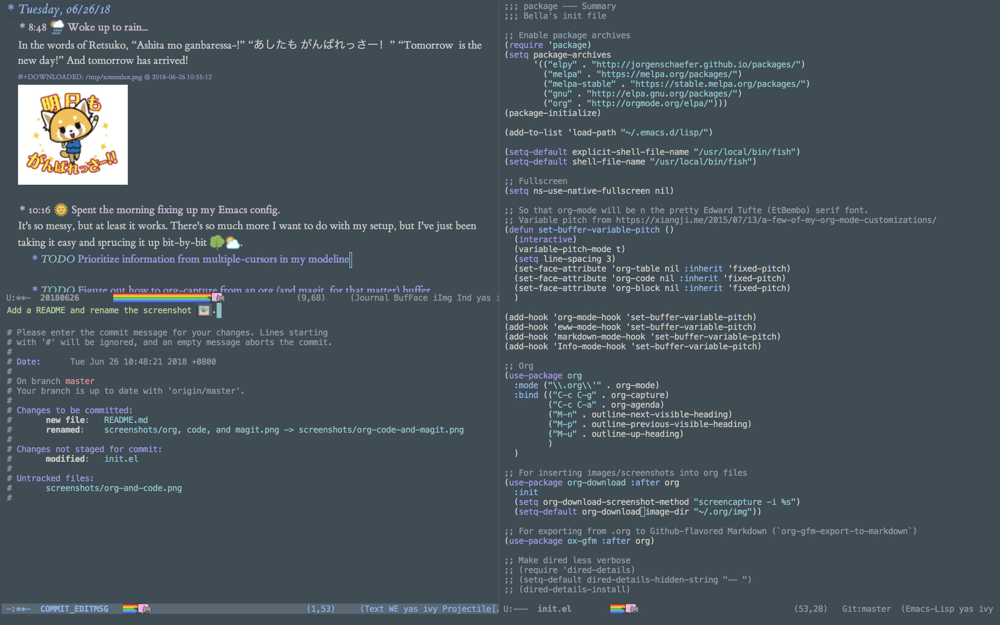
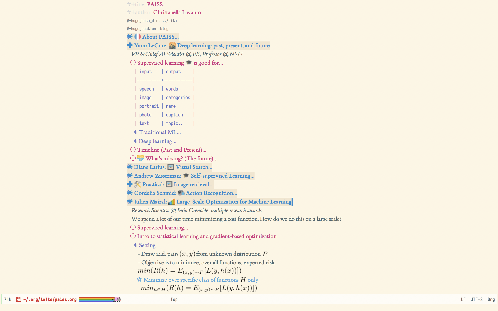

# .emacs.d



# Loved packages :heart_eyes_cat:
- [`magit`](https://magit.vc) for magic.
- [`org-download`](https://github.com/abo-abo/org-download/) for inserting images into `org` files.
- [`org-journal`](https://github.com/??) for easy journalling.
- [`ox-hugo`](https://github.com/??) for exporting Hugo blogposts.
- [`ox-reveal`](https://github.com/??) for exporting Reveal.js presentations.
- [`emojify`](https://github.com/??) because :100: :curry:
- [`nyan-mode`](https://github.com/??) because :rainbow:
- and many more, for sure!

# Emacs installation
```
brew install emacs --with-cocoa --with-gnutls --with-dbus --with-librsvg --with-imagemagick@6 --with-mailutils --devel
```
In particular, we need ImageMagick so that `org-image-actual-width` will work as expected.

# Non-Emacs setup
## For `flyspell`
```
brew install ispell --with-lang-en
```
## For `pdf-tools`'
```
brew tap dunn/emacs
brew install --HEAD pdf-tools
```
